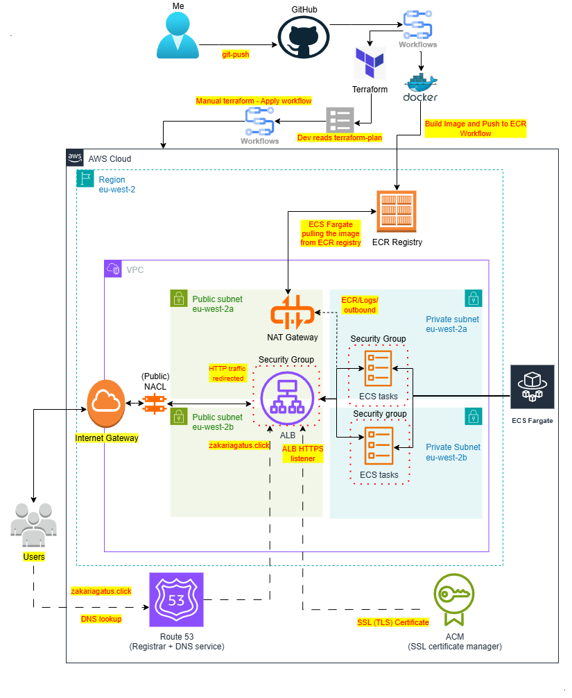

# ECS Fargate Infrastructure on AWS

This repository contains the Terraform code and CI/CD workflows to provision and deploy a highly available **ECS Fargate** application in AWS using an **Application Load Balancer (ALB)**, **Route 53** DNS, and **ACM** TLS/SSL certificates.

Although this is a solo project, the infrastructure uses a **Terraform remote backend** (S3 for state storage + DynamoDB for state locking) to simulate a collaborative team environment.  
This ensures:
- **State consistency** — changes are tracked centrally, avoiding drift.
- **Concurrency control** — DynamoDB locks prevent conflicting applies.
- **Real-world workflow** — mirrors how infrastructure teams coordinate changes in production environments.

> **Note on commit messages:**  
> In a collaborative environment, **clear, meaningful, and purposeful commit messages** are essential for tracking changes and enabling teammates to quickly understand the project’s history and intent.  
> For this solo project, I intentionally kept a more playful tone in my commit messages, often reflecting my debugging process in a lighthearted way. While fun, I recognize that in professional, team-based workflows, commit messages should follow a consistent and descriptive format to support effective collaboration.

---

## 🏗 Architecture Diagram

---

## 📜 Overview

The infrastructure provisions:

- **VPC** with:
  - 2 public subnets (one per AZ) for ALB and NAT Gateways
  - 2 private subnets (one per AZ) for ECS Fargate tasks
- **Public NACLs** for subnet-level filtering
- **Internet Gateway** for inbound access to ALB and outbound via NAT
- **NAT Gateway** for ECS outbound to AWS services (ECR, CloudWatch, etc.)
- **Routing tables**:
  - Public route table with `0.0.0.0/0` route via Internet Gateway
  - Private route table with `0.0.0.0/0` route via NAT Gateway
- **Security Groups** to restrict inbound/outbound traffic between ALB and ECS
- **ECS Cluster & Service** running Fargate tasks behind an ALB
- **Application Load Balancer (ALB)** with:
  - HTTP (80) → HTTPS (443) redirect
  - HTTPS listener with ACM certificate
  - Target group (IP mode) for ECS tasks
- **Route 53** hosted zone for DNS (alias record pointing to ALB)
- **ACM** TLS certificate for HTTPS
- **ECR** repository for application images
- **CloudWatch Logs** for container logging
- **Terraform remote state** in S3 + DynamoDB lock table

---

## 🧩 Application: Gatus Health Checker

This stack runs **[Gatus](https://github.com/TwiN/gatus)** as a lightweight uptime and health monitoring dashboard.  
- The service uses the **latest public Gatus image (`:latest`)**, mirrored/pulled via our ECR registry for deployment.  
- The ALB target group is configured for HTTP health checks on `/`, and the ECS service runs in private subnets behind the ALB.  
- I’ll add **future personal projects** to Gatus so this dashboard becomes the single place to see status across everything I host.

---

## 🔗 Accessing the Application

- **URL:** https://zakariagatus.click  
- HTTP automatically **redirects to HTTPS** (ACM certificate on the ALB).  

---

## ⚙️ CI/CD Workflow (GitHub Actions) 

This project uses multiple GitHub Actions workflows to separate **application deployment** from **infrastructure provisioning**, ensuring controlled, reviewable changes.

- **Source control:** GitHub  
- **Remote backend:** S3 + DynamoDB for team-ready state management (even as a solo project)  

### Workflow Triggers & Steps

1. **Docker Build & Push Workflow**  
   - **Trigger:** `git push` where the `Dockerfile` or relevant GitHub Actions workflow files have changed.  
   - **Steps:**  
     1. Build a new Docker image.  
     2. **Test the image** by running the container locally in the workflow and using `curl` to check that it responds correctly.  
     3. If the test passes, push the image to the ECR repository.  

2. **Terraform Plan Workflow**  
   - **Trigger:** `git push` where the `terraform/` directory or relevant GitHub Actions workflow files have changed.  
   - **Steps:**  
     1. Run `terraform fmt -check` to ensure all Terraform files follow the correct formatting conventions.  
     2. Initialize Terraform with the remote backend.  
     3. Run `terraform plan` to produce an execution plan.  
     4. Output the plan for the developer to review — **no changes are applied** at this stage.  

3. **Terraform Apply Workflow** (Manual Approval)  
   - **Trigger:** Manually executed by the developer from the GitHub Actions UI after reviewing the most recent plan.  
   - **Steps:**  
     1. Use the **saved plan** from the Terraform Plan workflow.  
     2. Run `terraform apply` to provision or update infrastructure.  
   - **Reason for manual step:**  
     - Provides a **final review checkpoint** before changes go live.  
     - Minimizes risk of unintended infrastructure changes.  

---

## 📚 Future Improvements

- Add AWS VPC endpoints for ECR and CloudWatch Logs to remove NAT Gateway dependency for these services.  
- Deploy an additional NAT Gateway in both public subnets for high availability (one per AZ).  
  - *Currently not implemented due to cost considerations, as each NAT Gateway incurs hourly charges and data processing costs.*  
- Expand Gatus configuration to monitor multiple personal and experimental services.  
- Implement alerting via SNS when a monitored endpoint goes down.
- Add automated scaling policies for ECS services based on CPU, memory, or custom CloudWatch metrics.  
- Integrate automated backups for Terraform state in case of S3 corruption or accidental deletion.  
---
